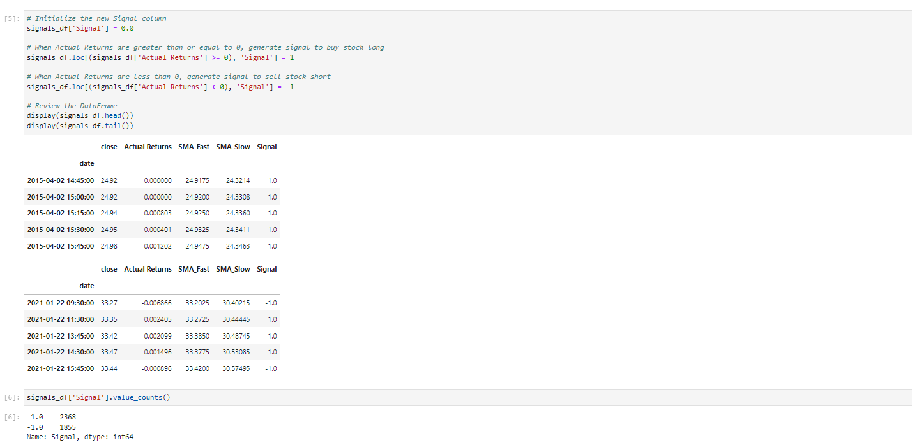
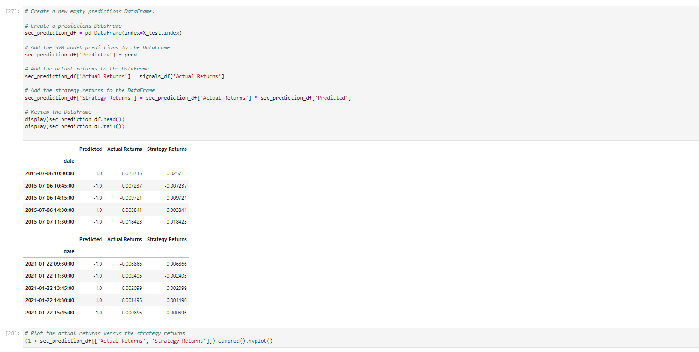

# Algorithmic-Trading-Bot
Use computer algorithms to buy and sell faster than human traders and generate profits.

Your firm constantly competes with the other major firms to manage and automatically trade assets in a highly dynamic environment. The speed of these transactions gave your firm a competitive advantage early on. But, people still need to specifically program these systems, which limits their ability to adapt to new data. You’re thus planning to improve the existing algorithmic trading systems and maintain the firm’s competitive advantage in the market. To do so, you’ll enhance the existing trading signals with machine learning algorithms that can adapt to new data.

The steps for this project are divided into the following sections:

1. Import the Data 
2. Establish a Baseline Performance
3. Tune the Baseline Trading Algorithm
4. Evaluate a New Machine Learning Classifier


---

## Technologies

This project leverages Anaconda and JupyterLab with Python 3.9:

* [Anaconda](https://www.anaconda.com/products/individual) 

Need to import the following libraries and dependencies:

```
import pandas as pd
import numpy as np
from pathlib import Path
import hvplot.pandas
import matplotlib.pyplot as plt
from sklearn import svm
from sklearn.preprocessing import StandardScaler
from pandas.tseries.offsets import DateOffset
from sklearn.metrics import classification_report

```

---

## Installation Guide

Before running the application first install the following dependencies.

1. Install [Anaconda](https://www.anaconda.com/products/individual) from link 
2. Open up GitBash(Windows) or Terminal(Mac)
3. Type ```conda update conda``` to update Conda
4. Type ```conda update anaconda``` to update Anaconda
5. Type ```conda create -n dev python=3.9 anaconda```
6. Type ```conda activate dev``` to activate conda
7. Install a dev environment kernel by typing ```python -m ipykernel install --user --name dev```
8. Install a node environment by typing ```conda install -c conda-forge nodejs```
9. Launch JupyterLab by typing ```jupyter lab```


---

## Usage

You will need to clone the repo so that you can run the application:

```
 https://github.com/locthai2002/Algorithmic-Trading-Bot.git

```

Here are some screenshots from running the application:

## **Import the Data**


## **Establish a Baseline Performance**





## **Evaluate a New Machine Learning Classifier**





---

## Contributors

Loc Thai -- www.linkedin.com/in/loc-thai-69b8a2141
Phone: 415.400.9998

---

## License

MIT
